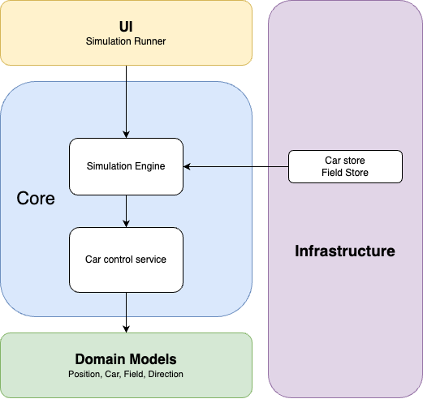

# Auto Car Simulation

## Overview

The Auto Car Simulation project is a command-line application that simulates the behavior of autonomous cars moving on a rectangular field. Users can add multiple cars—each with a unique starting position, direction, and set of movement commands—and then run the simulation. Cars execute commands concurrently, and the system detects collisions when two or more cars occupy the same grid position.

## Technical Specs

- **Target Framework:** .NET 8 (or later)
- **Testing Framework:** xUnit with Moq for mocking dependencies
- **Dependency Injection:** Implemented using [Microsoft.Extensions.DependencyInjection](https://www.nuget.org/packages/Microsoft.Extensions.DependencyInjection/)

## Features

- **Modular Design:** Separation of concerns between domain models, services, and UI.
- **Command Processing:** Each car processes commands (`L`, `R`, `F`) for left turn, right turn, and forward movement.
- **Collision Detection:** The simulation detects collisions and stops further processing for involved cars.
- **Stores for Domain Entities:**
  - **CarStore:** Manages the collection of cars.
  - **FieldStore:** Manages the current simulation field.
- **Dependency Inversion:** Uses interfaces for key components (e.g., `ICarControlService`, `ISimulationEngine`, `ICarStore`, `IFieldStore`) to promote testability.
- **User-Friendly CLI:** An interactive command-line interface guides users through setting up the field, adding cars, and running simulations.
- **Comprehensive Testing:** Automated tests using xUnit and Moq ensure robustness and correctness.

## High-Level Diagram

<p align="center">
  
</p>

## Architecture

- **Domain Layer:**  
  Contains immutable and mutable models:
  - `Position` (record)
  - `Direction` (enum)
  - `Field`
  - `Car`
- **Service Layer:**  
  Contains business logic and storage management:
  - **Car Processing:** `ICarControlService` and its implementation (`CarControlService`) → Car movement logic
  - **Simulation:** `ISimulationEngine` and its implementation (`SimulationEngine`) → Runs the simulation.
  - **Stores:**
    - `ICarStore` / `CarStore` → Stores and retrieves cars
    - `IFieldStore` / `FieldStore` → Manages simulation field
- **User Interface Layer:**
  - `SimulationRunner` handles user input, output, and overall flow.
- **Testing Layer:**
  - Unit tests written using xUnit and Moq (located in the `/Tests` folder).

## Installation

1. **Clone the Repository:**
   ```bash
   git clone https://github.com/Prashantjha73/AutoCarSimulation.git
   cd AutoCarSimulation
   ```
2. **Restore Dependencies & Build:**
   ```bash
   dotnet restore
   dotnet build
   ```
3. **Restore Dependencies & Build:**
   Verify that the .NET 8 SDK (or later) is installed on your machine.

## Usage

1. **Clone the Repository:**
   ```bash
   dotnet run --project AutoCarSimulation
   ```
   You will be prompted to:

- Enter the dimensions of the simulation field.
- Add one or more cars (providing name, initial position, direction, and command string).
- Run the simulation and view the results.

## Code Organization

- **/Domain:**  
  Contains immutable and mutable models:
  - `Enums`/`Direction` (enum)
  - `Model`/`Position` (record)
  - `Model`/`Field`
  - `Model`/`Car`
- **/Core**  
  Contains service interfaces and implementations:
  - `ICarControlService.cs` and `CarControlService.cs`
  - `ISimulationEngine.cs ` and `SimulationEngine.cs`
- **/Infrastructure:**
  Storage management
  - `ICarStore.cs` and `CarStore.cs`
  - `IFieldStore.cs` and `FieldStore.cs`
- **UI:**
  - `SimulationRunner`
- **Testing Layer:**
  - Contains xUnit test projects and classes (e.g., `CarControlServiceTests.cs` and `SimulationEngineTests.cs`).

## Example Scenarios

- **Single Car Simulation:**
  - **Field:** A 10 x 10 grid.
  - **Car A:** Starts at (1,2) facing North with the command string FFRFFFFRRL.
  - **Expected Outcome:** Car A processes its commands sequentially and ends at a defined position with a final facing direction.
- **Multiple Cars with Collision:**
  - **Field:** A 10 x 10 grid.
  - **Car A & Car B:** Start at positions that cause them to eventually occupy the same cell during simulation.
  - **Expected Outcome:** Both cars are marked as collided, and their final states indicate collision details.

## Testing Steps

1. **Run Automated Tests:** Execute the following command in the root directory:
   ```bash
   dotnet test
   ```
2. **Review Test Output:**

   - **Car Controller:** Verifying command processing and movement (`CarControlServiceTests`).
   - **Simulation Engine:** Checking simulation flow and collision detection (`SimulationEngineTests`).

3. **Manual Testing:** Run the simulation using `dotnet run` and try various scenarios to validate application behavior.

Enjoy exploring and extending the Auto Car Simulation!
